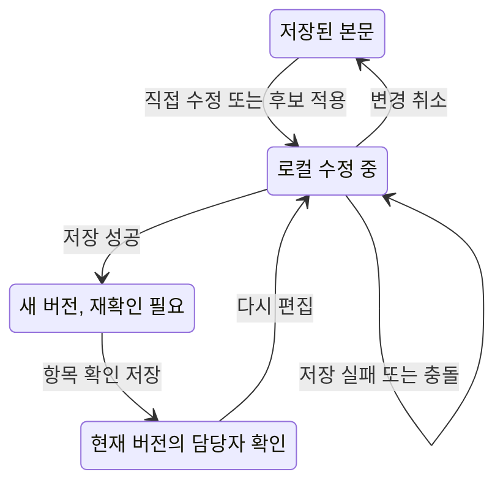

# 쉬운글 개선 UX 명세

**2026-09-24 추가·로컬 구현:** [읽기 수준 선택·집중 검토 계획](2026-09-24-reading-level-focused-review.md)에 따라 R8 수준 선택과 R1 결과 문단 중심 검토 UX를 구현했다. 아래 §5.2~5.3은 ER-23/25의 현행 로컬 구현 기준이며 두 기능은 기본 OFF다.

작성일: 2026-09-18 · 상태: R1 검수 패널과 R2 행동 안내 화면 구현·로컬 fake E2E 완료, R3~R7 화면은 설계안.

연결: [로드맵](2026-09-18-easy-read-improvement-roadmap.md) · [구현 명세](2026-09-18-easy-read-implementation-spec.md) · [검증 기준](2026-09-18-easy-read-validation-release.md).

## 1. 사용자와 주 작업

- 공공·복지 실무자: 초안을 고쳐 실제 배포할 수 있는 문서를 만든다. 원문 조건과 결과의 차이를 빨리 확인해야 한다.
- 정보 이용자: 배포된 글에서 대상·서류·기한·할 일을 찾는다. 실무자용 진단 UI나 규칙 코드는 필요하지 않다.
- 검수 담당자: 어떤 본문을 확인했는지 알 수 있어야 한다. 초기에는 문서 소유자가 담당자이며 타인 초대·협업 승인 흐름은 없다.

기존 ‘원문 넣기 → 변환 → 비교·수정 → 저장·내려받기’를 유지한다. 새 기능은 변환 완료 후 기존 검수 화면에 순서대로 추가한다. 별도 새 가입·작업 공간·전문가 모드는 만들지 않는다.

## 2. 정보 구조

데스크톱은 원문·쉬운 글 2열을 유지한다. 그 위에 작업 선택 `본문 검수 / 행동 안내 / 검수 기록`을 두되 기능이 켜진 항목만 표시한다. 검수 지원은 본문 검수 화면의 접을 수 있는 하단 영역으로 둬 3열이 되지 않게 한다. 좁은 화면에서는 원문/쉬운 글 전환을 유지하고 검수 목록을 그 아래 표시한다.

이 하단 검수 영역은 현행 R1 구현을 설명한다. ER-25가 활성화되면 실제 신호가 있는 결과 문단 안의 마크로 대체하고, 토글 OFF 또는 롤백 때만 기존 패널을 사용한다.

```text
[문서 제목]                         [저장] [내려받기]
[본문 검수] [행동 안내*] [검수 기록*]
┌ 원문 ──────────────────┬ 쉬운 글 ───────────────┐
│ 선택한 근거 위치        │ 기존 편집·문단 재변환   │
│                        │ 쉬운 말 찾기            │
└────────────────────────┴─────────────────────────┘
검수할 내용   확인 필요 4개 · 확인함 2개       [접기]
  [누락 의심] 제출 기한을 원문과 비교해 주세요.
  [조건 확인] ‘모두 충족’과 ‘하나만 충족’을 확인해 주세요.
  [원문 보기] [확인했어요] [해당 없음]

* 해당 단계가 출시된 경우만 표시
```

상단 저장·내려받기는 현재 선택한 작업의 대상을 명확히 표시한다. 본문 탭은 ‘본문 저장’, 행동 안내 탭은 ‘안내문 저장’으로 바꾼다. 두 편집기의 저장·dirty 상태를 혼동하지 않는다. 단계별 도입으로 버튼이 한꺼번에 늘어나지 않게 한다.

## 3. R1 본문 검수

### 3.1 기본 흐름

1. 변환 완료 후 원문과 쉬운 글을 읽는다.
2. ‘검수할 내용’에 진입하면 저장된 본문 기준의 무과금 분석을 준비한다.
3. 항목을 선택하면 해당 원문을 표시한다. 결과 위치를 확신하지 못하면 원문만 이동하고 ‘쉬운 글에서 직접 비교해 주세요’라고 안내한다.
4. 기존 편집기로 고친다. 편집 중에는 기존 확인 결과 위에 ‘수정 중인 글입니다. 저장한 뒤 다시 확인해 주세요’를 표시한다.
5. 본문 저장 후 최신 분석을 불러온다. 이전 확인 표시를 새 본문에 자동 적용하지 않는다.
6. ‘확인했어요’ 또는 사유를 적은 ‘해당 없음’을 저장한다. 확인 취소도 가능하다.
7. 기존 규칙에 따라 본문을 내려받는다. 검수 체크리스트를 모두 완료하도록 새 차단을 추가하지 않는다.

현행 패널에서는 전체 글을 확인했다는 버튼 하나로 모든 항목을 일괄 완료시키지 않는다. 항목 수가 많으면 종류별로 접고 누락 의심을 먼저 표시하며 관계 체크리스트 5종을 별도로 제공한다. ER-25 focused-review에서는 이 고정 체크리스트를 제거하고 실제 신호가 있는 문단만 §5.3 방식으로 확인한다.

### 3.2 상태·문구·동작

| 상태 | 표시 문구 | 사용자 동작 |
|---|---|---|
| 최초 분석 대기 | ‘확인할 내용을 준비하고 있어요’ | 본문 읽기·편집 가능, 확인 버튼 대기 |
| 누락 신호 없음 | ‘자동 검사에서 누락 의심 항목을 찾지 못했습니다. 조건과 예외는 직접 확인해 주세요’ | 관계 체크리스트 확인 |
| 누락 의심 | ‘원문에 있는 제출 기한이 결과에 남아 있는지 확인해 주세요’ | 원문 이동, 편집, 확인 |
| 위치 연결 불가 | ‘비교 위치를 정확히 찾지 못했습니다’ | 전체 원문·본문 비교 |
| 일부만 분석 | ‘검수 항목 일부만 표시됩니다. 문서 전체도 확인해 주세요’ | 제한 사유 확인 |
| 해당 없음 | ‘이 항목이 해당하지 않는 이유를 적어 주세요’ | 메모 후 저장, 취소 |
| 원문 모호함 | ‘원문 확인이 필요합니다’ | 미확인 유지 + 메모, 원문 작성자에게 별도 문의 |
| 확인 저장 중 | ‘확인 표시를 저장하고 있어요’ | 해당 항목 중복 클릭 방지 |
| 분석/저장 실패 | ‘검수 표시를 저장하지 못했습니다. 다시 시도해 주세요’ | 원문·편집 내용 유지, 재조회/재시도 |
| 본문 저장 후 이전 분석 | ‘본문이 바뀌었습니다. 확인할 내용을 다시 불러와 주세요’ | 무과금 재분석 |
| 다른 탭과 충돌 | ‘다른 화면에서 내용이 바뀌었습니다’ | 현재 편집 내용 복사, 최신 내용 불러오기 |
| 문서 만료·삭제 | ‘문서를 찾을 수 없습니다. 삭제되었거나 보관 기간이 지났을 수 있습니다’ | 메모리의 편집 내용은 명시적으로 복사 가능, 서버 저장/출력 차단 |

‘확인함 6/6’에는 ‘표시된 검수 항목 기준’ 설명을 붙인다. ‘100% 정확’, ‘인증 완료’, ‘안전한 문서’, ‘모든 의미 보존’ 같은 문구는 쓰지 않는다.

## 4. R2 행동 안내

**2026-09-26 UX 정정·미구현:** 아래 §4.1~4.3은 현행 흐름의 기록이다. 신규 UX는 [R2 진단·개선 계획](2026-09-26-action-guide-correction.md) §4를 우선한다. 먼저 안내문 적합성·판단 이유와 원문 근거가 있는 행동을 보여 준 뒤 ‘단계별 추가 안내’ 또는 ‘전체 문서 보완’을 선택한다. 적용 전 미리보기에도 주의사항·검토 상태·원문 근거 접근을 제공한다. 행동 1개도 정상 결과이며 없는 신청 단계를 만들지 않는다. 전체 보완은 기존 글과의 누락·변경 대조 후 명시적으로 본문에 반영하고, 추가 안내는 별도 보조자료로 저장한다. ER-27의 미리보기 수정만으로 전체 요구를 완료 처리하지 않는다.

### 4.1 생성 전

본문 검수 탭의 저장이 끝난 뒤 ‘행동 안내’ 탭에서 ‘안내문 만들기’를 누른다. 첫 화면은 다음을 보여 준다.

- 결과: 신청 대상·준비 서류·제출 순서를 별도 초안으로 정리한다.
- 원문에 없는 내용은 ‘원문에 안내 없음’으로 남는다.
- 현재 저장된 본문을 사용하며 본문을 자동 변경하지 않는다.
- 현재 구현은 서버가 알려 준 ‘필요 이용량 X크레딧 / 남은 이용량 Y크레딧’을 표시한다. 2026-09-21 확정된 D03에 따라 100자 단위로 0.1크레딧씩 표시한다. 소수 크레딧 구현·품질 평가·배포 확인 전에는 운영 토글을 OFF로 유지한다. 문구와 환불 안내를 실제 정책과 맞춘다.
- 과금 기본안이 채택되면 ‘초안이 만들어지면 이용량이 사용됩니다. 초안을 적용하지 않아도 사용됩니다’와 생성 실패 시 예약 반환 안내를 함께 표시한다.

본문이 dirty이면 ‘본문 저장 후 만들기 / 편집 계속하기’를 제공한다. 저장이 실패하면 생성을 호출하지 않는다. 확인 버튼은 ‘X크레딧으로 안내문 만들기’. 최초 확인 이후 같은 네트워크 요청 재전송에는 추가 모달을 띄우지 않고 같은 request_id를 쓴다.

### 4.2 안내문 편집 화면

```text
행동 안내                [안내문 저장] [TXT로 내려받기]
AI 초안 · 원문과 비교해 확인해 주세요.

신청할 수 있는 사람
  [편집 가능한 항목]                       [원문 보기]
준비할 서류
  [공식 서류 이름 + 짧은 설명]              [원문 보기]
신청 순서
  1. ...
     주의할 점: 해당 행동에 붙는 예외·기한
  2. ...
문의할 곳
  원문에 안내가 없습니다.

[ ] 원문과 비교하여 이 안내문의 내용을 확인했습니다.
```

6개 섹션을 고정된 순서로 보여 주되 `not_in_source`를 빈 칸처럼 숨기지 않는다. `needs_review` 항목을 먼저 안내하고 원문 비교를 제공한다. 사용자가 고친 항목의 원문 근거를 다시 선택할 수 있게 한다. 근거 없는 내용을 추가해 확인 완료로 만들지 않는다.

‘안내문 저장’은 미확인 초안도 저장한다. 최종 체크는 미해결 항목이 없는 경우에만 가능하다. 저장 이후 내용이나 근거가 바뀌면 체크를 해제한다. 별도 안내문의 내려받기는 저장·현재 본문 일치·현재 안내문 버전 확인이 모두 충족되어야 한다. 기존 본문 내려받기에는 이 제한을 전파하지 않는다.

### 4.3 비동기·실패·재생성

| 상태 | UX |
|---|---|
| queued/running | ‘안내문을 만들고 있어요. 다른 화면으로 이동해도 계속됩니다.’ 중복 생성 금지, 재방문 시 작업 조회 |
| 성공 | 후보를 기존 안내문과 비교하고 ‘적용’ 또는 ‘현재 안내문 유지’. 처음이면 ‘초안 사용’ |
| 생성 실패 | 기존 안내문·본문 보존. ‘다시 만들기’는 새 유료 요청임을 명시하고 다시 확인 |
| 결과 확인 불가 | 자동 재호출하지 않음. 같은 작업 재조회 후 새 요청 여부 선택 |
| 본문 변경 | ‘이전 본문으로 만든 안내문입니다.’ 출력 비활성, 이전 내용 복사·새로 만들기 |
| 결과 대기 중 안내문 편집 | 도착 후보로 자동 덮어쓰기 금지. 충돌 안내 후 현재 내용 보존 |
| 한도·잔액 부족 | 서버 메시지와 이용량 화면 이동. 제출 버튼으로 무한 재시도하지 않음 |
| 서버 혼잡 | 재시도 가능 시점을 안내. 크레딧 예약 전 거절이면 차감 없음 |

요청을 중단하거나 탭을 닫아도 작업 취소로 표시하지 않는다. 상태를 모르면 ‘완료’나 ‘취소됨’을 추측해서 보여 주지 않는다. 원장 비용·토큰·fencing 같은 구현 정보는 사용자 흐름에서 숨긴다.

## 5. R3~R7 UX

| 단계 | 화면 변화 | 지켜야 할 규칙 |
|---|---|---|
| R3 | 변환문 첫 등장 용어에 짧은 설명, 기존 쉬운 말 찾기 재사용 | 공식 서류명을 바꾸지 않음. 설명 부족을 문서 전체 실패처럼 표시하지 않음 |
| R4 | 표 검수 영역에 행·열 제목, 값, 단위, 관련 각주 표시 | 실제 구조를 모르면 표를 그럴듯하게 재구성하지 않음. ‘이 표의 관계를 자동으로 연결하지 못했습니다’ |
| R5 | 검수 기록 탭: 버전·시각·담당자·행위, 최근순 더 보기, 기록 TXT | 이전 버전은 ‘현재 본문과 다름’. 스냅샷 없는 기록은 명시. 인증서/영구 감사자료 표현 금지 |
| R6 | 용어별 ‘설명 더 보기/접기’ | 기본 본문·조건·예외는 항상 남김. 용어 설명이 없으면 무의미한 버튼 없음 |
| R7 | 문맥과 이유가 있는 그림 제안 → 사용자 생성 요청 → 미리보기·검토 → 선택 적용 | 무제안 허용, 자동 생성·자동 삽입 없음. 텍스트 정보 유지, 웹/개별 이미지/문서 파일 지원 구분 |

### 5.1 R7 문맥 기반 제안·생성(2026-09-24 정정)

‘이 신청 순서를 그림으로 보면 이해하기 쉬워요’처럼 **관련 문맥·제안 이유·그릴 내용**을 먼저 보여 준다. 사용자는 제안을 닫거나 ‘이 내용으로 그림 만들기’를 누른다. 이용량은 요청 전에 안내하며, 그림은 요청 후에만 생성한다. 생성 결과와 대체텍스트를 검토한 뒤 ‘문서에 추가’를 눌러야 적용한다. 기존 고정 그림 목록에서 줄마다 선택하는 흐름은 이 기능의 완료 기준이 아니다.

제안 없음·분석 실패·생성 중·실패/결과 불명확·완료/미적용·본문 수정 중·이전 버전 상태를 구분한다. 재방문은 기존 작업을 조회하고 새 생성·차감을 일으키지 않는다. 그림이 없어도 필수 조건·예외는 본문에서 읽을 수 있어야 한다. 키보드로 제안·생성·적용/제거를 조작하고 상태 변경을 접근 가능한 문구로 알린다.

초기에는 웹 미리보기와 이미지 개별 내려받기를 지원한다. DOCX/HWPX/TXT 파일에 그림이 포함되지 않는다는 점은 생성 전과 내려받기 옆에 표시한다. 다문단 문맥·상태별 문구·분석 시점은 [R7 수정 계획 §2~4](2026-09-24-contextual-illustration-correction.md#3-사용자-흐름과-상태)를 따른다. 새 흐름은 설계 상태이며 ER-17~20에서 구현한다.

### 5.2 R8 읽기 수준 선택(2026-09-24 추가)

글 붙여넣기/파일 올리기 안에서 변환 요청 전에 두 선택 카드를 표시한다.

| 선택 | 기본 문구 | 비용·길이 안내 |
|---|---|---|
| 기본 | `초등 5~6학년 수준으로 쉽게 써요` | 현행 필요 크레딧 |
| 더 쉽게 | `초등 3~4학년 수준을 목표로 더 풀어서 써요` | `설명이 길어질 수 있어요. 기본보다 최소 1.2배의 크레딧이 필요하며 0.1크레딧 올림 때문에 더 커질 수 있어요` |

기본 선택이 초기값이다. `더 쉽게`를 어린이 전용·이해 보장으로 표현하지 않는다. 붙여넣기는 현재 글자 수 기준 정확한 예상 크레딧을 선택 즉시 갱신한다. 파일은 `추출된 글자 수로 계산합니다`와 배수를 먼저 표시하고, 접수 완료 화면에서 서버가 예약한 정확한 양을 알린다. D11이 고객 요금으로 최종 확정되기 전에는 배수 차감 문구를 출시하지 않는다.

개인정보 경고 확인 후 같은 요청을 다시 보낼 때 제목·작업 공간·파일/본문과 함께 수준 선택도 보존한다. 접수 뒤 수준을 바꾸는 토글은 제공하지 않으며 다른 수준은 새 변환임을 안내한다. 상한 때문에 실행할 수 없으면 시작 전에 이유를 말하고 조용한 절단이나 기본 수준 대체를 하지 않는다.

### 5.3 R1 집중 검토 UX(2026-09-24 추가)

대응표가 유효하고 200단위 이하인 결과는 문단별 화면을 기본으로 연다. 모든 문단의 `대응 확인/추정` 배지와 별도 `문단별 상세 비교` 토글을 제거하고, 미확인 신호가 연결된 문단에만 `검토 필요 N개`를 표시한다.

문단 안에서는 짧은 사유, `원문과 비교`, `이 문단 확인했어요`를 먼저 보인다. 여러 항목은 하나의 마크로 묶고 한 번의 확인을 트랜잭션으로 저장한다. `해당 없음`·사유는 보조 펼침 영역에 둔다. 확인한 마크는 즉시 사라지며 접힌 `확인 완료` 또는 검수 이력에서 다시 열 수 있다.

| 상태 | 표시·동작 |
|---|---|
| 신호 0건 | 검토 마크 없음. 정확성·검수 완료라고 표시하지 않음 |
| 편집 중 | 기존 마크 비활성/숨김, `저장하면 검토할 부분을 다시 찾습니다` |
| 저장 후 | 새 content revision 자동 분석, 이전 확인을 자동 승계하지 않음 |
| 위치 없음 | 결과 상단 `결과에서 위치를 찾지 못한 검토 항목 N개`, 임의 문단에 붙이지 않음 |
| 지도 없음·201단위 이상 | 전체 textarea 유지 + 결과 상단 검토 요약 |
| stale·409 | 로컬 편집 보존, 최신 본문/assessment 재조회 후 다시 확인 |

결과 제목 옆에는 `검토 필요한 문단 N개`만 요약하고 기존 하단의 두 그룹·전체 진행률은 제거한다. 토글 OFF에서는 기존 패널을 유지해 롤백할 수 있으며 제한 파일럿 뒤 단계적으로 제거한다.

## 6. 편집·탐색 불변식



본문/안내문의 탭 이동·문서 이동 시 기존 미저장 변경 보호를 재사용한다. 두 편집기에 dirty가 있으면 어느 내용이 저장되지 않았는지 이름으로 안내한다. 서버 409를 받았다고 현재 로컬 내용을 지우거나 자동 재제출하지 않는다. 전체 문서 내용을 localStorage에 새로 보관하지 않는다.

저장 요청 중 추가 편집이 허용되는 경우 응답의 요청 시점 본문을 기준으로 saved state만 갱신한다. 이후 입력한 내용은 dirty로 남겨야 한다. 복잡하면 해당 저장이 끝날 때까지 대상 편집기만 잠그되 페이지 전체를 막지 않는다. 구현 PR은 한 방식을 고정해 테스트한다.

## 7. 접근성·모바일 인수 체크

- 키보드만으로 탭·검수 항목·원문 이동·편집·확인·저장·출력을 수행한다. 포커스 순서는 화면 읽기 순서와 같다.
- ‘원문 보기’ 후 원문 영역 제목/해당 줄에 포커스를 옮기고 ‘검수 항목으로 돌아가기’를 제공한다. 기존 문단 하이라이트와 충돌하지 않는다.
- 상태는 색만으로 구분하지 않고 텍스트·아이콘·접근 가능한 이름을 함께 쓴다.
- 저장·생성 완료는 적절한 live region으로 알린다. polling마다 같은 메시지를 반복 읽지 않는다.
- 확인/생성 단계는 이름·설명·초기 포커스·닫은 뒤 포커스 복귀를 갖춘다. 모달을 쓰는 경우 대화상자 의미와 초점 가둠을 제공한다. Escape로 닫아도 서버 작업 취소를 뜻하지 않는다.
- 320px 폭과 200% 확대에서 본문·버튼이 잘리지 않게 한다. 표의 가로 스크롤은 해당 영역에 한정한다.
- 터치 목표는 44px를 설계 목표로 사용한다. 결과가 특정 접근성 인증을 충족한다고 자동 주장하지 않는다.
- 토글 OFF, 키보드, 긴 제목, 200단위 초과, 지도 없음, 한글 조합 입력, 빈 섹션·긴 원문 인용을 확인한다.

## 8. 구현 전 준비물

각 단계마다 실제 공개 원문 1건의 기본/모바일 화면 예시, loading/empty/error/stale 예시, 문구 목록, 키보드 동선을 PR에 첨부한다. R0는 텍스트 와이어프레임과 수동 예시로 시작할 수 있다. 고해상도 디자인이나 외부 사용자 모집을 모든 구현의 필수 선행조건으로 두지 않는다.
